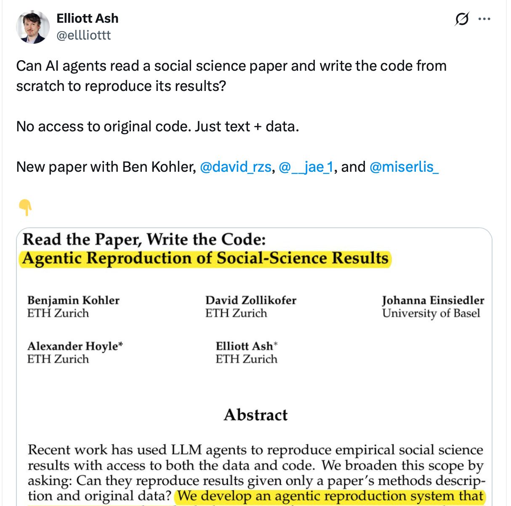
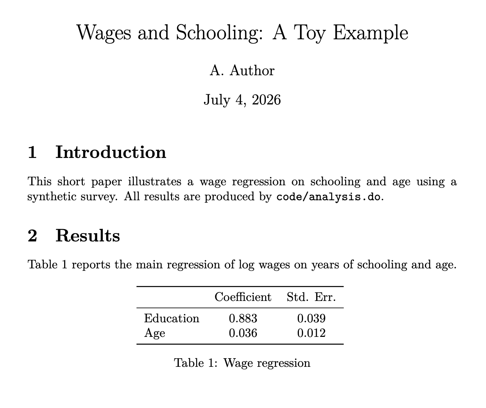

## Agenda {#sec-questions}


<br>

::: {.incremental}
1. Will LLMs solve our reproducibility troubles?

2. Will LLMs help **authors** prepare replication packages?

3. Will LLMs help **data editors** check replication packages?

4. **General Guidance** when using LLMs in your work.

:::


<!-- ---

## What Is an LLM — and Why Does It Matter Here?

<br>

::: {.callout-note}

# Hey, Claude: What is an LLM?

A large language _model_ (LLM) is an AI system trained on vast amounts of _data_ to predict and generate language.
:::


::: {.fragment}


<table>
<thead>
<tr><th>#</th><th>LLM/Deep Learning Use</th><th>Reproducibility problem?</th></tr>
</thead>
<tbody>
<tr class="fragment"><td>1</td><td>Statistical learning (deep nets, nonparametric 'metrics)</td><td>No new problem</td></tr>
<tr class="fragment"><td>2</td><td>Code assistant (LLM writes your code)</td><td>No — output is conventional code</td></tr>
<tr class="fragment"><td>3</td><td><strong>LLM in data pipeline (scores, classifies, generates data)</strong></td><td><strong>Yes — LLM output enters the data chain</strong></td></tr>
</tbody>
</table>


::: -->


## Q1: Will LLMs Solve Reproducibility? {#sec-q1}

### The dream vs. reality


::: {.columns}

::: {.column}


::: {.content-hidden when-profile="offline"}
<blockquote class="twitter-tweet"><a href="https://twitter.com/ellliottt/status/2047667528579596347"></a></blockquote>
<script async src="https://platform.twitter.com/widgets.js" charset="utf-8"></script>
:::

::: {.content-visible when-profile="offline"}

:::


:::

::: {.column}


::: {.fragment}


**Dream:** Supply a replication package URL, get a coffee, agent reports back.

:::

::: {.fragment}

**Reality:** Depends on the package. Three cases.

:::

<br>

::: {.fragment}

::: {.callout-tip}

# Different Use Case!

Ours is a different use case from Elliott's!

1. [Their paper](https://elliottash.com/papers/Kohler-Zollikofer-Einsiedler-Hoyle-Ash-Read-Paper-Write-Code-Agentic-Reproduction-Social-Science-Results.pdf)
2. [Their code](https://github.com/benjamin-kohler/social_science_replicability)

:::

:::
:::

:::


---

## Q1 (cont.): Which Package? {#sec-q1-cases}

### Where does an agent actually help?

:::{.incremental}

1. **Complete (containerized?) package**
Agent can run it. But so can a shell script.

1. **Package has gaps** *(missing deps, broken paths, bad README)*
Agent infers, fixes, iterates. Hours (Weeks?) → minutes. **This is where agents can help.**

1. **Requires software/data/hardware you don't have.** Agent is irrelevant. No LLM fixes a missing _GAUSS_ license or provides the required GPU.

:::

::: {.fragment}
→ The right question is not "will LLMs solve reproducibility?"
→ It's **"where in the workflow does an LLM/agent provide most leverage?"**
:::


---

## Q2: Will LLMs Help Authors with Packages? {#sec-q2}


::: {.columns}

::: {.column}


:::

::: {.column}

<br>

::: {.incremental}

1. Project starts in 2019
2. Cond. Accepted in 2025
3. 🤔 - package does not work.
4. Panic.

:::

:::

:::


## Q2: Will LLMs Help Authors with Packages?


## Q2: Will LLMs Help Authors with Packages? 


### DeadReckoning *(proposed / in development)*


[https://github.com/floswald/DeadReckoning](https://github.com/floswald/DeadReckoning)

**Phase 1 — Understand**
Detect languages · scan live environment · trace every exhibit in latex source back to a script

**Phase 2 — Repair**
Iterative build-test-fix loop on author's machine · handles R, Stata, Julia, Python, MATLAB. Docker containerization is the *last* step — fix natively first

::: {.fragment}
**Key:** `No lockfile ≠ information is gone`
Reconstructs history from file timestamps, code parsing, installed packages
:::


## `DeadReckoning` Demo

<br>

::: {.columns}
::: {.column}

### Conditionally Accepted Paper



:::

::: {.column}


### Replication Package


```
.
├── code
│   └── analysis.do
├── data
│   ├── region_boost.csv
│   └── survey.csv
├── paper.pdf
├── paper.tex
├── README.md
└── tables
    └── table1.tex


```


:::

:::


## `DeadReckoning` Demo

<br>

### Package `README`

```
# Replication package: Wages and Schooling (toy example)

## Data
- `data/survey.csv` — synthetic survey of wages, schooling, and age (n=200)

## Code
- `code/analysis.do` — runs the regression, produces `tables/table1.tex`

## Requirements
- R (tidyverse)

## To reproduce
Run `code/analysis.do` from the project root.
```

## `DeadReckoning` Demo

::: {.content-hidden when-profile="offline"}
```{=html}
<script src="https://asciinema.org/a/QVxTfbEoU81mUeYX.js" id="asciicast-QVxTfbEoU81mUeYX" async="true"></script>
```
:::

::: {.content-visible when-profile="offline"}
```{=html}
<link rel="stylesheet" href="offline-assets/asciinema-player/asciinema-player.css">
<div id="cast-1"></div>
<script src="offline-assets/asciinema-player/asciinema-player.min.js"></script>
<script src="offline-assets/casts/cast1.js"></script>
<script>AsciinemaPlayer.create(window.CAST1_DATA_URL, document.getElementById('cast-1'));</script>
```
:::

## `DeadReckoning` Demo

::: {.content-hidden when-profile="offline"}
```{=html}
<script src="https://asciinema.org/a/Nd2Nau0n6DZ53SeH.js" id="asciicast-Nd2Nau0n6DZ53SeH" async="true"></script>
```
:::

::: {.content-visible when-profile="offline"}
```{=html}
<link rel="stylesheet" href="offline-assets/asciinema-player/asciinema-player.css">
<div id="cast-2"></div>
<script src="offline-assets/asciinema-player/asciinema-player.min.js"></script>
<script src="offline-assets/casts/cast2.js"></script>
<script>AsciinemaPlayer.create(window.CAST2_DATA_URL, document.getElementById('cast-2'));</script>
```
:::


---

## Q3: Will LLMs Help Data Editors? {#sec-q3}

Something like **DeadReckoning** works also for Data Editors. Builds full data map and finds gaps. Helpful first pass for Replicators.

<br>

::: {.fragment}

### Big(ger?) issue: Computational Environment

:::

::: {.fragment}

Docker is great, but not widely known. (`DeadReckoning` wants to help.) Also, no silver bullet either.

[**SIVACOR**](https://docs.sivacor.org) *(Vilhuber/Cornell, running for AEA)*
Author submits ZIP → curated Docker image → automated execution → signed TRO
Editor verifies without re-running

[**Nuvolos**](https://nuvolos.com) Cloud based computing environment with snapshotting and BYOL

:::

---

## Q4: General Guidance

So, what's the actual problem with LLMs when used in my data pipeline? 


::: {.fragment}

Well, let's find out. 

:::

##


::: {.columns}

::: {.column}


.jpg)


:::

::: {.column}


::: {.fragment}

> John Maynard Keynes lived ...
:::


::: {.fragment}

What's the next word?

:::


::: {.fragment}

Let's ask `Llama-3.2-1B`.


:::


:::

:::


##  {background-image="img/keynes-llama.png" background-size="contain" background-position="center"}


## The Integrity Gap {#sec-integrity}

With conventional code: read it, run it, diff outputs. Accountability intact.

With an LLM pipeline, we cannot detect:

- Prompt tuning toward a desired result
- Cherry-picking across stochastic runs *(run 20 times, keep the best)*
- Outright output fabrication

::: {.fragment}
**We can verify *that* a pipeline was applied.**
**We cannot verify *how honestly* it was applied.**
:::

---

## What We Can Ask For

### Minimum disclosure standard for LLM pipelines

1. Full prompt *(mandatory)*
2. Raw output exactly as received *(mandatory)*
3. Model name · version · temperature · sampling parameters *(mandatory)*
4. Open-weight model → archived weights or stable link
5. Closed API → state limitation explicitly in paper

::: {.fragment}
**Treat LLM output as raw data. Archive it with a DOI.**
Describe the model as you would any instrument.
:::

---

## Summary {#sec-summary}


| Question | Answer |
|----------|--------|
| LLMs solve reproducibility? | No — Computational Env 1st order|
| Help authors? | Yes — Case 2 automation is real (DeadReckoning) |
| Help editors? | Yes — log-diffing, README checking (SIVACOR, A&S) |
| LLM-as-data? | Same principle · harder enforcement|


---

## Backup Slides {visibility="uncounted"}

---

## The Coordination Temptation {visibility="uncounted"}

### "If everyone used Python/R/Julia..."

**Right:** provisionability improves. Mandate the *outcome* (must run in clean container), not the tool. Already what SIVACOR does.

**Wrong:** open-source ≠ reproducible.
- Only 31% of econ packages have a controller script — not a language problem
- Dependency rot, unset seeds, FP nondeterminism survive any language mandate
- Stata scores Yes/Yes/Yes on reproducibility-in-principle — more reproducible than a closed LLM API

**Can't legally redistribute Stata in a public Docker image anyway.**
Containerization moves the licensing problem; doesn't dissolve it.

---

## Same Principle, New Problem {visibility="uncounted"}

### The break is on row 3

| Tool | Deterministic? | Archivable? | Re-runnable? |
|------|---------------|-------------|--------------|
| GAUSS / Stata / R | Yes | Yes | Yes |
| Open-weight LLM (Llama, Mistral) | Yes (seed+temp) | Yes (weights) | Yes, with effort |
| Closed API (GPT-4, Claude) | No | No | No guarantee |

`gpt-4o` today ≠ `gpt-4o` six months ago. Model-name-plus-version is insufficient.

---

## Three-Layer Archive Taxonomy {visibility="uncounted"}

| Layer | What it is | Archive strategy |
|-------|-----------|-----------------|
| Pre-trained LLM | Base model weights | HuggingFace if open; name+date if closed |
| Fine-tuned LLM | Your weights | Privacy constraints may apply |
| Analysis output | What the LLM returned | Always — DOI in replication package |

Most economists use layer 3. Hardest to reproduce. Easiest to archive.

---

## Handling Stochastic Variability {visibility="uncounted"}

### Vilhuber's recommendation

Run queries **10+ times** · capture output distribution
Apply **multiple imputation (Rubin/Reiter rules)**
Report LLM-induced variance separately from sampling variance

Right standard for results hinging on LLM classification or scoring.

*"Hopefully quite close" is not a reproducibility standard.*
